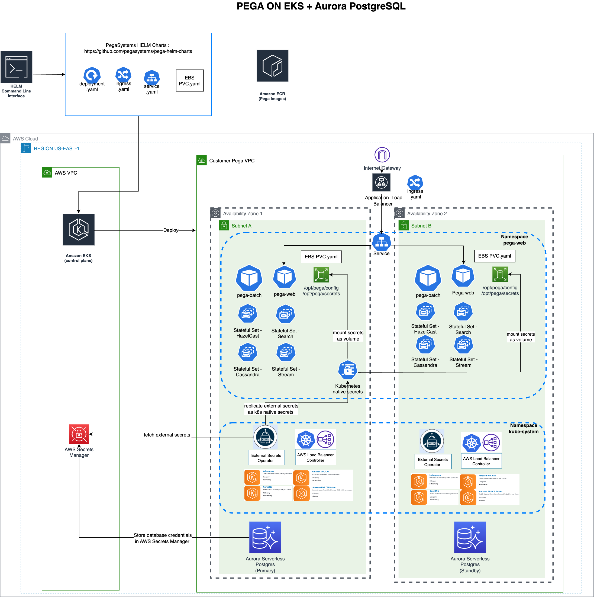
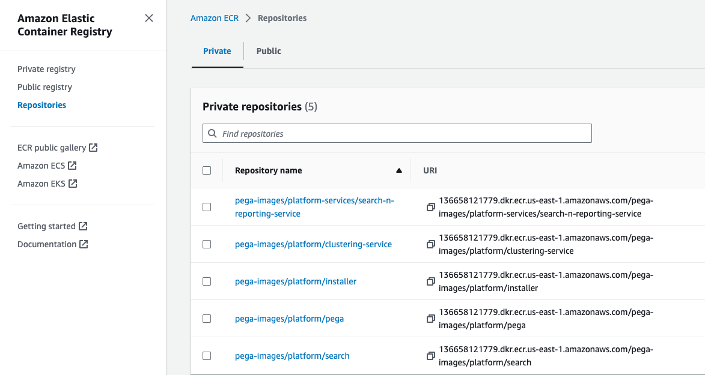
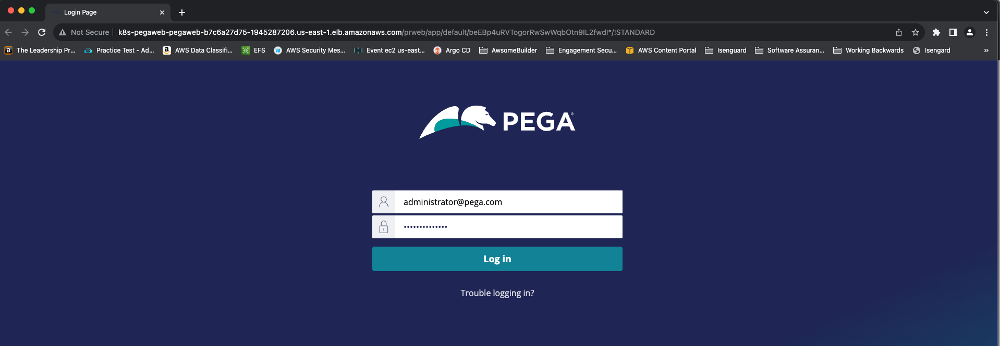
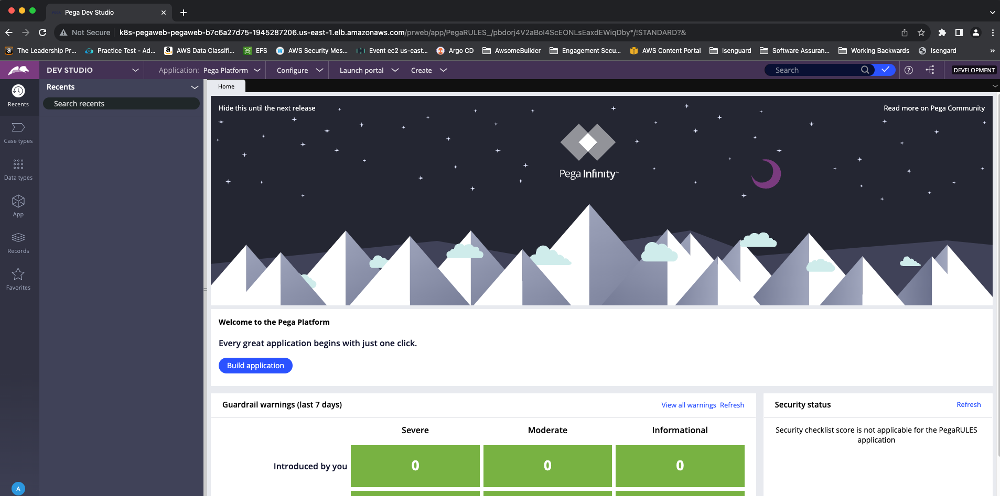
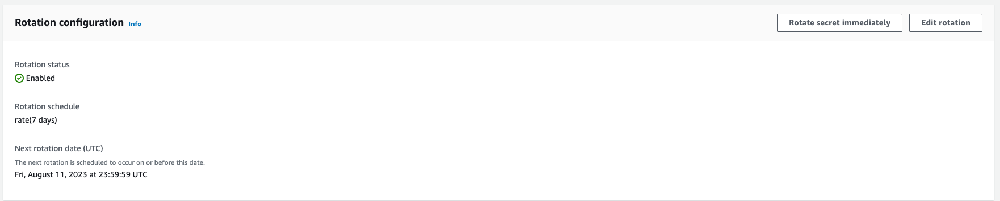

# Amazon EKS (Tomcat) and Amazon Aurora PostgreSQL blueprint for Pega

Welcome to blueprint for running Pega platform on EKS ( Tomcat) and Amazon Aurora PostgreSQL. The project is structured as follows

    .
    ├── pega
    │    ├── 1-infrastructure-eks-aurora --> (Terraform code which creates 1. EKS cluster with necessary add-ons 2. Provisions Aurora PostgreSQL Serverless v2   )
    │    ├── 2-secret-management-awssecretsmanager --> (Replicates secrets from external secret store such as AWS Secrets manager as native Kubernetes secrets  )
    │    ├── 3-pega-application-deployment-helm --> (Deploys Pega application components using helm)
     
                                 



This project is forked from EKS blueprints for Terraform  https://github.com/aws-ia/terraform-aws-eks-blueprints/tree/v4 and customized for Pega deployment on EKS. 


## Prerequisites :

1. Install AWS cli https://docs.aws.amazon.com/cli/latest/userguide/getting-started-install.html
2. Install kubectl https://kubernetes.io/docs/tasks/tools/
3. Install helm https://helm.sh/docs/intro/install/
4. Install terraform https://developer.hashicorp.com/terraform/tutorials/aws-get-started/install-cli
5. Create a private ECR repository of Pega-provided Docker images as shown below. For more information see the links below
                a. https://docs-previous.pega.com/client-managed-cloud/87/pega-provided-docker-images
                b. https://docs.aws.amazon.com/AmazonECR/latest/userguide/docker-push-ecr-image.html




## Getting Started - Please follow these instructions in sequence

STEP 1. Create required Infrastructure using terraform (Create EKS Cluster + required Kubernetes add-ons,provision Aurora database,create all the required secrets and store them in AWS secrets manager)

```
cd ./pega/1-infrastructure-eks-aurora  
```
```
terraform init
```
```
terraform apply 
```

Infrastructure creation will take about 20 minutes.

####  Output should look like below  

```
Apply complete! Resources: 95 added, 0 changed, 0 destroyed.

Outputs:

aurora-jdbc-write-url = <<EOT
jdbc:postgresql://pega2-postgresqlv2.cluster-cv7ba80pgvtb.us-east-1.rds.amazonaws.com/pegadb 
 
EOT
configure_kubectl = <<EOT
configure kubectl: aws eks --region us-east-1 update-kubeconfig --name pega2 

EOT
list-of-secrets = toset([
  "rds!cluster-2571d018-7087-402f-997a-7a6c79abc06d"
])

```

Configure kubectl by running command shown in output example 

```
aws eks --region us-east-1 update-kubeconfig --name pega2
```

Make a note of list-of-secrets value ( ```rds!cluster-2571d018-7087-402f-997a-7a6c79abc06d``` in the example above ) This is the name of the secret holding Aurora Username and Password. This secret is automatically created by Aurora when database is provisioned. Alterntaly you can get this secret name by logging into AWS secrets manager from AWS console. 

We will use this value to configure secrets in step#2 

Make a note of JDBC URL - this will be required for configuration during step #3 


STEP 2. Configuring Secrets : Deploy External secret provider configurations in EKS cluster. This consists of deploying 1/ AWS secrets manager as external secret store and 2/ IRSA for Secret Store  to access AWS Secrets 3/External Secret configurations which will import AWS secrets as kubernetes native secrets. 

open file ../2-secret-management-awssecretsmanager/pega-credentials-secret.yaml and update row # 37 and row #41 with value from list-of-secrets output from step #1. In the example above the value is rds!cluster-2571d018-7087-402f-997a-7a6c79abc06d

Once updated run the following commands 
    
```
cd ../2-secret-management-awssecretsmanager 

kubectl apply -f .
```

#### Output should look like below
```
externalsecret.external-secrets.io/pega-credentials-secret created
externalsecret.external-secrets.io/pega-ecr-password created
externalsecret.external-secrets.io/pega-ecr-url created
externalsecret.external-secrets.io/pega-ecr-username created
externalsecret.external-secrets.io/pega-ecr-credentials created
serviceaccount/pega-web-sa created
secretstore.external-secrets.io/aws-secrets-manager created
```

Confirm secrets are imported into kubernetes cluster 

```
kubectl get externalsecrets -n pega-web
```

#### Output should look like below

```
NAME                                                         STORE                 REFRESH INTERVAL   STATUS         READY
externalsecret.external-secrets.io/pega-credentials-secret   aws-secrets-manager   1h                 SecretSynced   True
externalsecret.external-secrets.io/pega-ecr-credentials      aws-secrets-manager   1h                 SecretSynced   True
externalsecret.external-secrets.io/pega-ecr-password         aws-secrets-manager   1h                 SecretSynced   True
externalsecret.external-secrets.io/pega-ecr-url              aws-secrets-manager   1h                 SecretSynced   True
externalsecret.external-secrets.io/pega-ecr-username         aws-secrets-manager   1h                 SecretSynced   True

NAME                                                  AGE     STATUS   CAPABILITIES   READY
secretstore.external-secrets.io/aws-secrets-manager   2m40s   Valid    ReadWrite      True
```

STEP3: Deploy Pega Application components 

##### NOTE: BEFORE YOU BEGIN , Please make sure the Database Password DOES NOT have XMl special characters (& < > " ' ).If any of these special characters are present, rotate the secret in AWS Secrets manager until the rotated secret is free of the Without ensuring this 5 speacil, the installation will fail. See Troubleshooting section for more details 


open file ```../ 3-pega-application-deployment-helm/pega.yaml```. This is the values.yaml for pega-helm-charts. 

Most of the configurations have already been made for you in this file. We just need to update JDBC url and ECR image urls 

Take the JDBC URL from step #1 and update it in row# 41 

Update Respective ECR image Repo URLS ( complete URLS) in row #s 100, 404, 410,432 and 434

Update the Pega Admin Password that you prefer in row #413

Deploy Pega by running the following commands 

##### Note:  For first time installation use --set global.actions.execute=install-deploy flag ( see commands below) This will run pega database installer and  install the rules and database schemas onto Aurora PostgreSQL. 

#### Note:Database installation will take about 40 minutes.

For subsequent installations use flag --set global.actions.execute=deploy. This will skip detabase installer and deploy application components only. 

For more information refer : https://github.com/pegasystems/pega-helm-charts

```
cd ../3-pega-application-deployment-helm

helm repo add pega https://pegasystems.github.io/pega-helm-charts

# First time installation run the following. This will run pega databze installer and deploy pega applications on EKS 

helm install pega pega/pega --namespace pega-web  --values pega.yaml --set global.actions.execute=install-deploy  --no-hooks

# Subsequent installations, run this command. This will skip database installation.

helm install pega pega/pega --namespace pega-web  --values pega.yaml --set global.actions.execute=deploy  --no-hooks
```

#### Output should be like below 

```
NAME: pega
LAST DEPLOYED: Fri Aug 11 11:31:33 2023
NAMESPACE: pega-web
STATUS: deployed
REVISION: 1
TEST SUITE: None
```

You can check the list of Kubernetes Objects deployed along with their status by running the following command 

```kubectl get all -n pega-web```

#### Output should look like this
```
NAME                              READY   STATUS     RESTARTS   AGE
pod/pega-batch-75db4f4d8f-c4nqk   0/1     Init:0/3   0          24m
pod/pega-cassandra-0              1/1     Running    0          24m
pod/pega-cassandra-1              1/1     Running    0          23m
pod/pega-cassandra-2              1/1     Running    0          21m
pod/pega-db-install-jqnfh         1/1     Running    0          24m
pod/pega-hazelcast-0              1/1     Running    0          24m
pod/pega-hazelcast-1              1/1     Running    0          24m
pod/pega-hazelcast-2              1/1     Running    0          23m
pod/pega-search-0                 1/1     Running    0          24m
pod/pega-stream-0                 0/1     Init:0/3   0          22m
pod/pega-web-796455757-4h9qs      0/1     Init:0/3   0          24m

NAME                             TYPE        CLUSTER-IP       EXTERNAL-IP   PORT(S)                                        AGE
service/pega-cassandra           ClusterIP   None             <none>        7000/TCP,7001/TCP,7199/TCP,9042/TCP,9160/TCP   24m
service/pega-hazelcast-service   ClusterIP   None             <none>        5701/TCP                                       24m
service/pega-search              ClusterIP   172.20.112.118   <none>        80/TCP                                         24m
service/pega-search-transport    ClusterIP   None             <none>        80/TCP                                         24m
service/pega-stream              NodePort    172.20.208.126   <none>        7003:31384/TCP                                 24m
service/pega-web                 NodePort    172.20.108.90    <none>        80:32731/TCP                                   24m

NAME                         READY   UP-TO-DATE   AVAILABLE   AGE
deployment.apps/pega-batch   0/1     1            0           24m
deployment.apps/pega-web     0/1     1            0           24m

NAME                                    DESIRED   CURRENT   READY   AGE
replicaset.apps/pega-batch-75db4f4d8f   1         1         0       24m
replicaset.apps/pega-web-796455757      1         1         0       24m

NAME                              READY   AGE
statefulset.apps/pega-cassandra   3/3     24m
statefulset.apps/pega-hazelcast   3/3     24m
statefulset.apps/pega-search      1/1     24m
statefulset.apps/pega-stream      0/2     24m

NAME                                                 REFERENCE               TARGETS           MINPODS   MAXPODS   REPLICAS   AGE
horizontalpodautoscaler.autoscaling/pega-batch-hpa   Deployment/pega-batch   <unknown>/2550m   1         5         1          24m
horizontalpodautoscaler.autoscaling/pega-web-hpa     Deployment/pega-web     <unknown>/2550m   1         5         1          24m

NAME                        COMPLETIONS   DURATION   AGE
job.batch/pega-db-install   0/1           24m        24m
```

Once Database installation is complete and all components are running get the url for Pega Web

```sh
kubectl get ingress/pega-web -n pega-web
```
#### Output should look like this

```
NAME       CLASS    HOSTS   ADDRESS                                                                 PORTS   AGE
pega-web   <none>   *       k8s-pegaweb-pegaweb-b7c6a27d75-1945287206.us-east-1.elb.amazonaws.com   80      28m

```
Open the browser to access the application via the ALB address http://k8s-pegaweb-pegaweb-b7c6a27d75-1945287206.us-east-1.elb.amazonaws.com



Login username : administrator@pega.com 
Password as specified in ../3-pega-application-deployment-helm/pega.yaml

You will be asked to change the password after first log in. 

Pega-web landing page



⚠️ You might need to wait a few minutes, and then refresh your browser.

⚠️ If your Ingress isn't created after several minutes, then run this command to view the AWS Load Balancer Controller logs:

```sh
kubectl logs -n kube-system deployment.apps/aws-load-balancer-controller
```

STEP 4. Destroy

To teardown and remove the resources created in this example:

```sh
terraform destroy -auto-approve
```

## Troubleshooting and Known issues 


##### NOTE:  Database password is automatically created by RDS Aurora and stored in secrets manager. This Secret may contain special xml characters (& < > " ' ) which cannot be configured by Tomcat in context.xml file. Rotate the Aurora secrets by going into AWS Secrets Manager --> Select secret created by Aurora --> Rotation Configuration -->  Rotate secrets immediately. 

##### Note : Rotate the secret until RDS secret is free of (& < > " ' )

For more info see Escaping XML Special Characters in Java String : https://www.geeksforgeeks.org/escaping-xml-special-characters-in-java-string/





## Support & Feedback

This project is maintained by AWS Solution Architects. It is not part of an AWS service and support is provided best-effort basis. To post feedback, submit feature ideas, or report bugs, please use the [Issues section]() of this repo. If you are interested in contributing to EKS Blueprints, see the [Contribution guide]().


## License

Apache-2.0 Licensed. See [LICENSE](./LICENSE).
